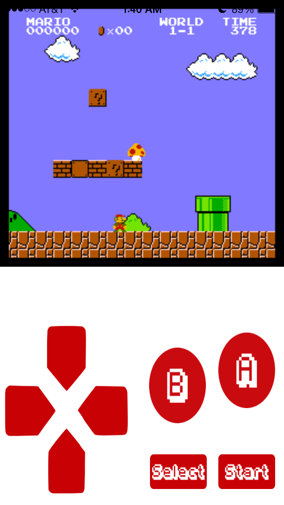
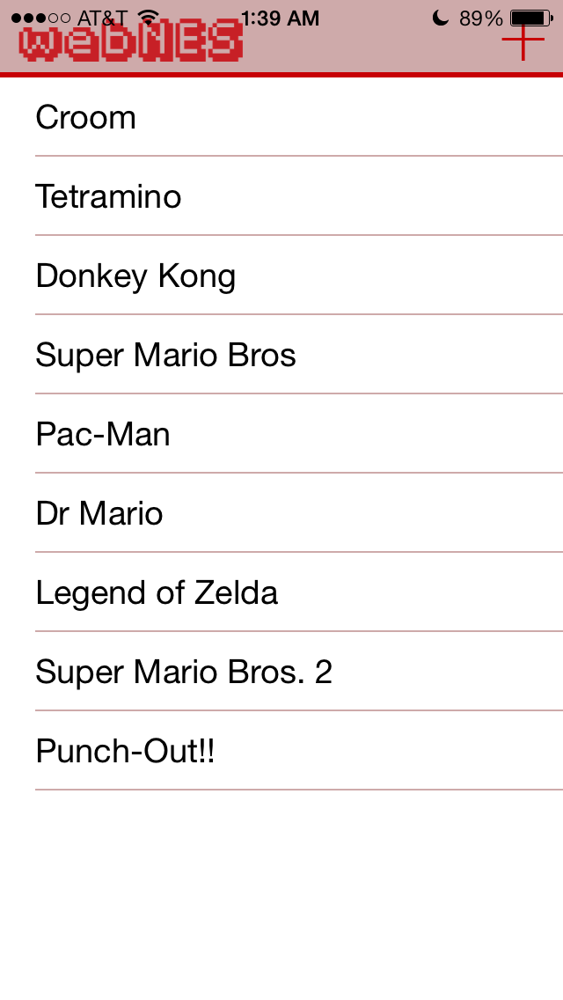
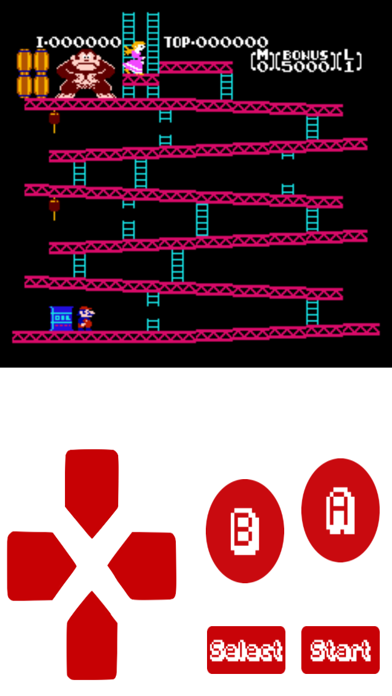
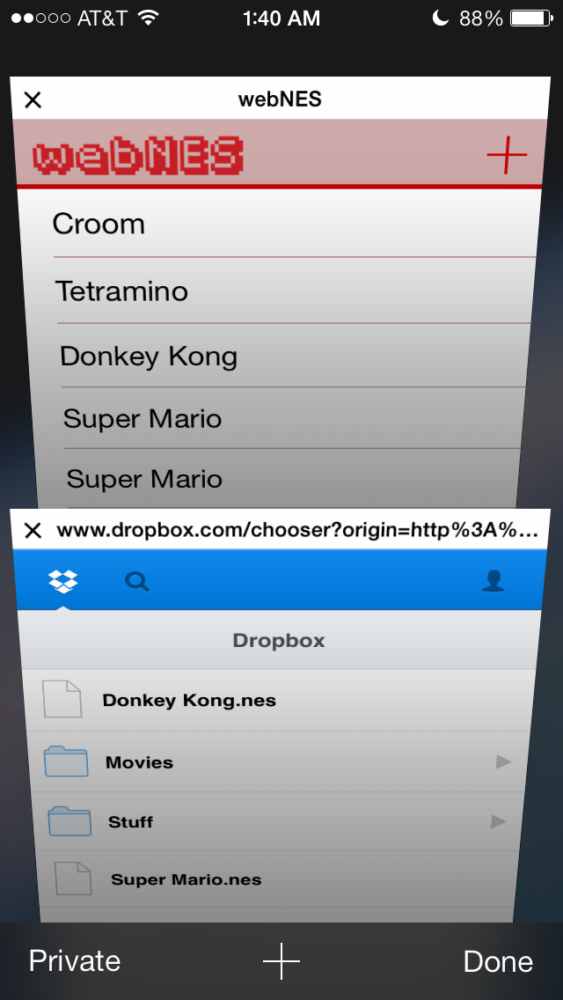

(CE stands for Community Edition!)

An NES emulator for mobile devices.
=======

<https://htv04.github.io/webnes-ce/>

**NOTE: This is nowhere near finished. There are still loads of changes I have to make, such as updating JSNES, making sure there are aboslutely no bugs, and changing the art.**

An NES emulator for everyone.

webNES is a web-based NES emulator for *mobile*. You can access the web app on any mobile browser. You can add ROMs via Dropbox and use the emulator while offline. The touch based controls are just as responsive as a native app.

The emulator was based off of the existing JSNES (<https://github.com/bfirsh/jsnes>) library, with modifications to support the HTML5 Web Audio API. We used jQuery to build the touch interface, Local Storage and WebSQL to store the ROMs offline. It also supports the HTML5 Offline Application Cache, allowing you to use the emulator with no internet connection. It can even be added as an icon to the home screen for a full screen, immersive experience.

Above, there is the portrait UI and Super Mario Brothers. 

webNES menu screen

Donkey Kong

Importing ROMs from DropBox

The Developers
========
* HTV04 [@HTV04](https://github.com/HTV04)
* Autumn Rowan [@autumnation](https://github.com/autumnation) (Thanks so much for helping me get this to work again!)
* Heath123 [@Heath123](https://github.com/Heath123) (Nearest neighbor scaling)

Original Developers:
* Conrad Kramer [@conradev](https://github.com/conradev)
* Jared Wright [@jawerty](https://github.com/jawerty)
* Bogdan Vitoc [@bogidon](https://github.com/bogidon)
* Evan Klein [@elklein96](https://github.com/elklein96)

### Props to the Creator of jsNES
* Ben Firshman [@bfirsh](https://github.com/bfirsh)

This app was built during the spring PennApps 2014 hackathon by Conrad, Jared, Bogdan, Evan and was a finalist (top 10).
